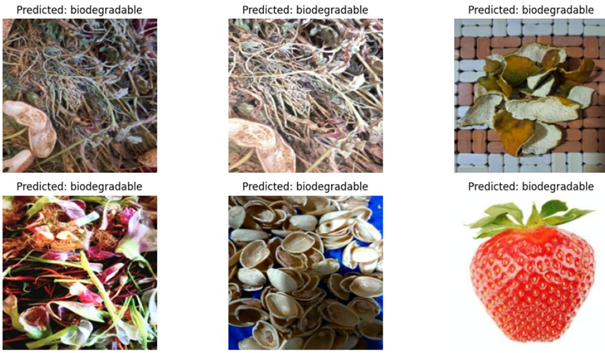

# 🌱 SustainSort-Dynamics: Smart Waste Classification

[](LICENSE)  
[]

## 🚀 Project Overview

Proper waste segregation is crucial for sustainability. **SustainSort-Dynamics** automates the classification of kitchen (wet) waste vs. non-degradable waste using deep learning and computer vision. We fine-tune multiple **pre-trained models** (VGG16, VGG19, ResNet50, MobileNetV2, DenseNet121) for classification, and apply **YOLOv5** for object detection within the waste stream.

Our custom waste dataset — captured using a mobile phone under varied lighting and backgrounds — is annotated directly on [Roboflow](https://roboflow.com). We have augmented and normalizeed images in roboflow.

## 📂 Repository Structure

```
SustainSort-Dynamics/
├── Notebooks/
│   ├── VGG16.ipynb               # VGG16 model training and evaluation
│   ├── vgg19.ipynb               # VGG19 model training and evaluation
│   ├── ResNet_18(CNN).ipynb      # ResNet18 model training and evaluation
│   ├── mobileNetV2.ipynb         # MobileNetV2 model training and evaluation
│   ├── DenseNet.ipynb            # DenseNet model training and evaluation
│   └── YoloV5.ipynb              # YOLOv5 object detection
├──  Results/
│   ├── vgg16_output.png          # Output visualization from VGG16 model
│   ├── vgg19_output.png          # Output visualization from VGG19 model
│   ├── resnet18_output.png       # Output visualization from ResNet18 model
│   ├── mobilenetv2_output.png    # Output visualization from MobileNetV2 model
│   ├── densenet_output.png       # Output visualization from DenseNet model
│   └── yolov5_output.png         # Output visualization from YOLOv5 model
└── README.md
```

## 🛠️ Installation & Setup

1. **Clone the repo**
   ```bash
   git clone https://github.com/YourUser/SustainSort-Dynamics.git
   cd SustainSort-Dynamics
   ```

2. **Access the datasets**
   - **Classification dataset**:  
     https://universe.roboflow.com/sustainsort-dynamics/waste-detection-classification-eyd3h
   - **Object detection dataset**:  
     https://universe.roboflow.com/sustainsort-dynamics/waste-detection-obj.-detection/dataset/1
   - **Reference datasets used**:
     - [Waste Classification Dataset (Roboflow)](https://universe.roboflow.com/chandigarh-university-ux87l/waste_classification-rwunp/browse?queryText=&pageSize=50&startingIndex=50&browseQuery=true)
     - [E-Waste Image Dataset (Kaggle)](https://www.kaggle.com/datasets/akshat103/e-waste-image-dataset)

## 🔍 Dataset Information

Our project uses a customized dataset created through a combination of:
1. Our own captured images using mobile phones
2. Reference datasets from Roboflow (organic/inorganic waste classification)
3. E-waste images from Kaggle

This approach ensured diversity in our training data and improved model robustness across different waste categories and environments.

## 🔧 Usage

1. **Data loading & preprocessing**
   - Open any of the model notebooks
   - In the data loading section, add your Roboflow API key and dataset link
   - The notebooks handle augmentation and preprocessing automatically

2. **Train classification models**
   - Open one of the following notebooks:
     - `VGG16.ipynb`
     - `vgg19.ipynb`
     - `ResNet_18(CNN).ipynb`
     - `mobileNetV2.ipynb`
     - `DenseNet.ipynb`
   - Run all cells to train and evaluate the model

3. **Run object detection**
   - Open `YoloV5.ipynb`
   - Add your Roboflow API key and dataset link
   - Follow the instructions to set up and run YOLOv5 detection

4. **View results & metrics**
   - Results are displayed directly in the notebooks
   - Saved outputs can be found in the `results/` folder

## 📊 Model Performance

| Model             | Accuracy (%) | Precision | Recall | F1-Score |
|:------------------|:-------------|:----------|:-------|:---------|
| VGG16             | 96.67        | 96.0      | —      | —        |
| VGG19             | 98.89        | 98.5      | —      | —        |
| ResNet18          | 85.56        | 85.0      | —      | —        |
| MobileNetV2       | 91.1         | 91.0      | —      | —        |
| DenseNet121       | 95.2         | 95.5      | —      | —        |
| YOLOv5            | —            | —         | —      | —        |

**VGG19 achieved the highest performance with 98.89% accuracy and 98.5% precision, outperforming all other models in our waste classification task.**

## 📸 Sample Outputs

<div align="center">
  
  <!-- 
  
  
  
   -->
</div>

## 🧐 Tech Stack

- **Pre-trained Models**: VGG16, VGG19, ResNet18, MobileNetV2, DenseNet121, YOLOv5
- **Data Annotation & Hosting**: [Roboflow](https://roboflow.com)
- **Notebook Environment**: Google Colab

## 📚 References

1. **Beyond the Bin:** Machine Learning-Driven Waste Management for a Sustainable Future
2. **Deep Learning Applications in Solid Waste Management**
3. **Roboflow Documentation:** https://docs.roboflow.com/
4. For more detailed information, access our published IEEE paper: [Smart Waste Classification Using Deep Learning](https://ieeexplore.ieee.org/document/XXXXXXX)

## 🤝 Contributing

1. Fork the repo
2. Create your feature branch (`git checkout -b feature/YourFeature`)
3. Commit your changes (`git commit -m "Add some feature"`)
4. Push to the branch (`git push origin feature/YourFeature`)
5. Open a Pull Request

## 📄 License

This project is licensed under the [MIT License](LICENSE).


